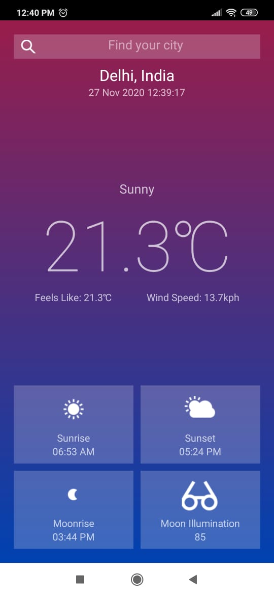
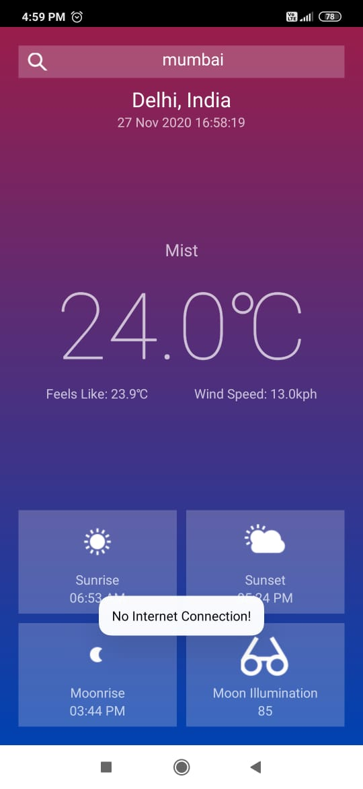

# PhotoWeather
PhotoWeather is a native android application designed for photographers. It uses [WeatherAPI](https://www.weatherapi.com/)

## Tools and Technologies Used
   * XML
   * Java
   
## Preview

